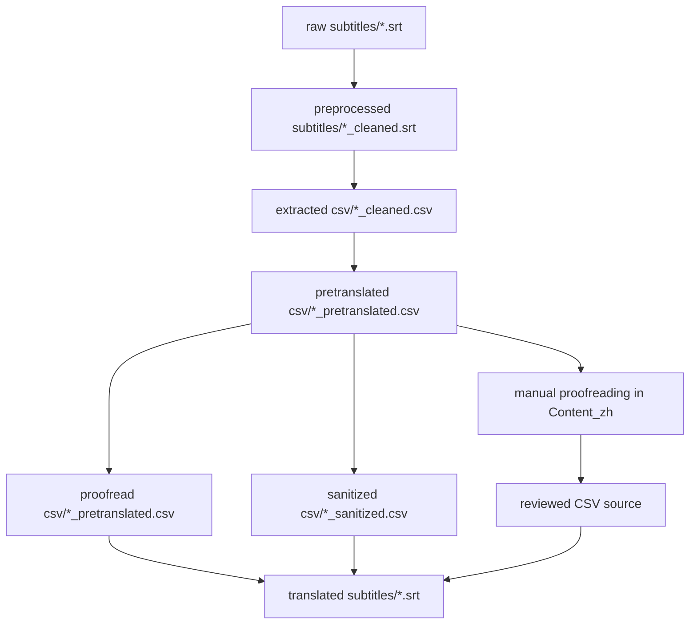

# DoubleFineAdventureZHTranslationProject

Traditional Chinese (Taiwan) subtitle translation project for the [*Double Fine Adventure!*](https://www.youtube.com/playlist?list=PLIhLvue17Sd7F6pU2ByRRb0igiI-WKk3D) documentary series.

This repository is a subtitle data and workflow repo. It contains the English source subtitles, cleaned subtitle files, extracted CSVs, machine pretranslations, episode summaries, a Traditional Chinese glossary, proofreading guidance, conversion scripts, and GitHub Actions workflows for repeatable pipeline steps.

## Current Status

The checked-in data currently covers all 20 episodes through the machine-pretranslation stage.

| Stage | Path | Current state |
| --- | --- | --- |
| Raw English subtitles | `raw subtitles/` | 20 SRT files |
| Preprocessed English subtitles | `preprocessed subtitles/` | 20 cleaned SRT files |
| Extracted English CSVs | `extracted csv/` | 20 CSV files, 10,979 data rows |
| Machine pretranslations | `pretranslated csv/` | 20 CSV files, 10,979 data rows |
| Episode summaries | `summary/` | 20 Markdown summaries |
| Glossary | `glossary.md` | Traditional Chinese terminology and naming decisions |
| Proofreading plan | `proofreading-plan.md` | Style guide, QA checklist, and manual proofreading workflow |
| First-pass proofread CSVs | `proofread csv/` | Generated by script; not present in the current checkout |
| Sanitized CSV output | `sanitized csv/` | Generated by script/workflow; not present in the current checkout |
| Final translated SRT output | `translated subtitles/` | Generated by script/workflow; not present in the current checkout |

The `pretranslated csv/*.csv` files are working translation files, not final human-reviewed subtitles. The next major project step is manual row-by-row proofreading of `Content_zh` against each row's English `Content`, using `glossary.md`, `proofreading-plan.md`, and the episode summaries for context.

## Repository Layout

| Path | Purpose |
| --- | --- |
| `raw subtitles/` | Original English SRT files for episodes `01` through `20`. |
| `preprocessed subtitles/` | Cleaned English SRT files with merged lines/cues and renumbered subtitle blocks. |
| `extracted csv/` | CSV files extracted from cleaned SRTs, with `Timecode` and `Content` columns. |
| `pretranslated csv/` | Machine-generated Traditional Chinese translations, with `Content_zh` added. |
| `summary/` | Traditional Chinese episode summaries, one Markdown file per episode. |
| `glossary.md` | Living glossary for names, titles, terminology, speaker labels, and machine-translation fixes. |
| `proofreading-plan.md` | Proofreading priorities, style rules, QA checklist, and recommended workflow. |
| `scripts/` | Python scripts for preprocessing, CSV extraction, machine translation, sanitization, first-pass proofreading, and SRT generation. |
| `.github/workflows/` | GitHub Actions definitions for extraction, pretranslation, sanitization, and SRT conversion. |

## Workflow



`proofread csv/`, `sanitized csv/`, and `translated subtitles/` are generated-output locations. They are supported by the scripts, but they are not checked in at the moment.

## Prerequisites

- Python 3.9+
- `openai` for machine pretranslation
- `opencc` for Simplified-to-Traditional conversion in the sanitizer
- An OpenAI API key for machine pretranslation, supplied through `OPENAI_API_KEY` or `--api_key`

The project does not currently include a dependency manifest. Install script dependencies manually before running steps that need them:

```bash
python -m pip install openai opencc
```

## Local Usage

Run commands from the repository root.

### 1. Preprocess Raw SRT Files

```bash
python scripts/srt_preprocess.py --path "./"
```

Reads `raw subtitles/` and writes cleaned SRT files to `preprocessed subtitles/`.

### 2. Extract CSV Files

```bash
python scripts/extract_csv.py --path "./"
```

Reads `preprocessed subtitles/` and writes CSV files to `extracted csv/`.

### 3. Machine Translate CSV Files

```bash
OPENAI_API_KEY="your-api-key" python scripts/translate_csv_batch.py --path "./"
```

Reads `extracted csv/` and writes translated CSV files to `pretranslated csv/`.

Note: `translate_csv_batch.py` currently uses the legacy `openai.ChatCompletion.create` API. Pin an older compatible OpenAI Python SDK or update the script before rerunning this step with the current SDK.

### 4. First-Pass Automated Proofreading

```bash
python scripts/proofread_content_zh.py
```

Reads `pretranslated csv/` and writes first-pass proofread files to `proofread csv/`. This script applies glossary-oriented replacements, punctuation normalization, cue normalization, and common machine-translation fixes. It is a helper pass only; it does not replace human proofreading.

### 5. Optional Sanitization

```bash
python scripts/sanitize_content_zh.py --path "./"
```

Reads `pretranslated csv/` by default and writes sanitized CSV files to `sanitized csv/`. The sanitizer is intended to convert Simplified Chinese to Traditional Chinese and add spacing between half-width and full-width text.

Review and test this step before relying on it for production output. `proofreading-plan.md` notes that the current sanitizer implementation needs care because its character loop can drop characters when the spacing condition is not met.

### 6. Convert CSV Files Back To SRT

```bash
python scripts/convert_csv_to_srt.py --path "./" --input "pretranslated csv"
```

Reads CSV files with a `Content_zh` column and writes SRT files to `translated subtitles/`.

If you generate automated proofread files first, convert those instead:

```bash
python scripts/convert_csv_to_srt.py --path "./" --input "proofread csv"
```

## CSV Format

Extracted CSV files contain:

| Column | Description |
| --- | --- |
| `Timecode` | Original SRT time range, such as `00:00:32,655 --> 00:00:35,274`. |
| `Content` | English subtitle text. |

Pretranslated, proofread, and sanitized CSV files contain:

| Column | Description |
| --- | --- |
| `Timecode` | SRT time range preserved from the source file. |
| `Content` | Original English subtitle text. |
| `Content_zh` | Traditional Chinese subtitle text used when generating final SRT files. |

During proofreading, edit only `Content_zh` unless you are intentionally correcting subtitle timing. Preserve `Timecode` and `Content` so output can be compared and converted safely.

## Proofreading Guidance

- Use Traditional Chinese suitable for a Taiwanese audience.
- Prefer natural spoken subtitle phrasing over literal English sentence structure.
- Follow `glossary.md` for names, game titles, technical terms, speaker labels, and recurring machine-translation fixes.
- Preserve speaker labels when they clarify who is speaking.
- Use full-width punctuation in Chinese text.
- Keep subtitle text concise enough to read comfortably on screen.
- Do not remove or rewrite `Timecode` values unless timing correction is required.

For the detailed style guide and QA checklist, see `proofreading-plan.md`.

## Episode Summaries

The `summary/` directory contains one Traditional Chinese Markdown summary per episode, `01.md` through `20.md`. These summaries are useful for continuity, scene context, names, callbacks, and ambiguous lines during manual proofreading.

## GitHub Actions

All workflows are manually runnable unless otherwise noted.

| Workflow file | Purpose |
| --- | --- |
| `.github/workflows/extract_csv.yml` | Runs `scripts/extract_csv.py` and opens a pull request with extracted CSV changes. |
| `.github/workflows/pretranslation.yml` | Runs `scripts/translate_csv_batch.py` and opens a pull request with pretranslated CSV changes. Requires an `OPENAI_API_KEY` repository secret. |
| `.github/workflows/sanitization.yml` | Runs `scripts/sanitize_content_zh.py` and opens a pull request with sanitized CSV changes. |
| `.github/workflows/convert_to_srt.yml` | Converts CSV files back to SRT and opens a pull request with generated subtitle changes. Also triggers on changes under `sanitized csv/`. |

Known workflow caveat: `convert_to_srt.yml` is named as if it converts sanitized CSVs, but it currently runs `convert_csv_to_srt.py --path "./"` without `--input "sanitized csv"`, so the script default is `pretranslated csv/`.

## Known Maintenance Items

- Add a dependency manifest, such as `requirements.txt`, with pinned package versions.
- Update `translate_csv_batch.py` for the current OpenAI Python SDK or pin an SDK version compatible with `openai.ChatCompletion.create`.
- Review and fix `sanitize_content_zh.py` before relying on it for production output.
- Clean up copied labels/comments in `.github/workflows/extract_csv.yml`; the file currently contains sanitizer-oriented labels while running extraction.
- Align `.github/workflows/convert_to_srt.yml` with its sanitized-CSV name/trigger, or change its default input intentionally.
- Decide whether final SRT generation should use `pretranslated csv/`, generated `proofread csv/`, generated `sanitized csv/`, or a separate manually reviewed output folder.
- Continue manual row-by-row proofreading of `pretranslated csv/*.csv` before treating the subtitles as final.
