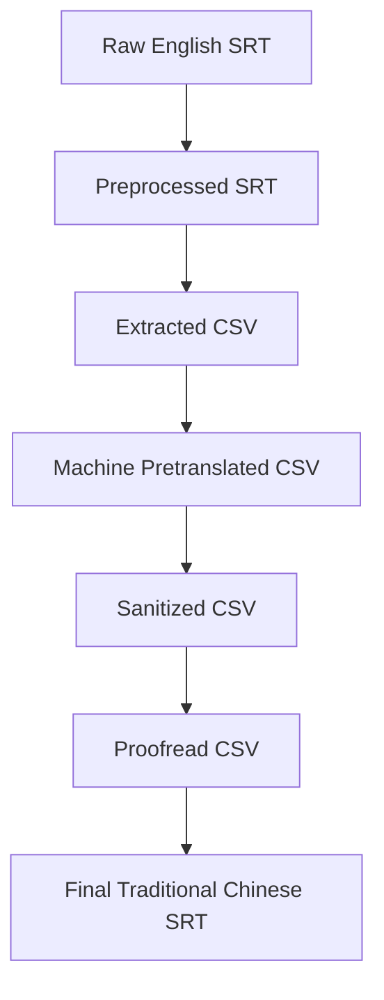

# DoubleFineAdventureZHTranslationProject

This project creates Traditional Chinese (Taiwan) subtitles for the [*Double Fine Adventure!*](https://www.youtube.com/playlist?list=PLIhLvue17Sd7F6pU2ByRRb0igiI-WKk3D) documentary series.

The repository contains the English source subtitles, intermediate CSV files for translation and proofreading, Python scripts for each conversion step, and GitHub Actions that can automate parts of the pipeline.

## Current Status

| Stage | Directory | Status |
| --- | --- | --- |
| Raw English subtitles | `raw subtitles/` | 20 SRT files |
| Preprocessed subtitles | `preprocessed subtitles/` | 20 cleaned SRT files |
| Extracted CSV files | `extracted csv/` | 20 CSV files |
| Machine pretranslations | `pretranslated csv/` | 3 CSV files |
| Sanitized translations | `sanitized csv/` | Not generated yet |
| Final translated subtitles | `translated subtitles/` | Not generated yet |

## Workflow



## Repository Layout

| Path | Purpose |
| --- | --- |
| `raw subtitles/` | Manually fetched English SRT files from the source videos. |
| `preprocessed subtitles/` | Cleaned SRT files with merged lines and more complete subtitle cues. |
| `extracted csv/` | Spreadsheet-friendly CSV files extracted from cleaned SRT files. |
| `pretranslated csv/` | CSV files with machine-generated Traditional Chinese translations. |
| `sanitized csv/` | Intended output from Simplified-to-Traditional and spacing cleanup. |
| `translated subtitles/` | Intended final Traditional Chinese SRT output. |
| `scripts/` | Python scripts used by the subtitle pipeline. |
| `.github/workflows/` | GitHub Actions for generating pipeline outputs and pull requests. |

## Prerequisites

- Python 3.9+
- `openai` for machine pretranslation
- `opencc` for Traditional Chinese sanitization
- An OpenAI API key for pretranslation, provided with `OPENAI_API_KEY` or `--api_key`

The project does not currently include a dependency manifest. Install the required packages manually before running the relevant scripts:

```bash
python -m pip install openai opencc
```

## Local Usage

Run commands from the repository root.

### 1. Preprocess Raw SRT Files

```bash
python scripts/srt_preprocess.py --path "./"
```

Reads from `raw subtitles/` and writes cleaned files to `preprocessed subtitles/`.

The preprocessing script:

- Trims extra whitespace.
- Merges two-line subtitle cues into one line.
- Merges a cue with the next cue when the first cue does not end with punctuation.
- Renumbers subtitle cues after merging.

### 2. Extract CSV Files

```bash
python scripts/extract_csv.py --path "./"
```

Reads from `preprocessed subtitles/` and writes CSV files to `extracted csv/`.

### 3. Machine Translate CSV Files

```bash
OPENAI_API_KEY="your-api-key" python scripts/translate_csv_batch.py --path "./"
```

Reads from `extracted csv/` and writes translated CSV files to `pretranslated csv/`.

### 4. Sanitize Translated CSV Files

```bash
python scripts/sanitize_content_zh.py --path "./"
```

Reads from `pretranslated csv/` and writes sanitized files to `sanitized csv/`.

This step converts Simplified Chinese to Traditional Chinese using OpenCC's Taiwan preset and inserts spacing between half-width and full-width text where appropriate.

### 5. Convert CSV Files Back To SRT

```bash
python scripts/convert_csv_to_srt.py --path "./" --input "sanitized csv"
```

Reads proofread or sanitized CSV files and writes final SRT files to `translated subtitles/`.

If you want to convert directly from machine pretranslations before sanitization or proofreading, omit `--input` to use the script default of `pretranslated csv/`.

## CSV Format

Extracted CSV files contain:

| Column | Description |
| --- | --- |
| `Timecode` | Original SRT time range, such as `00:00:32,655 --> 00:00:35,274`. |
| `Content` | English subtitle text. |

Pretranslated, sanitized, and proofread CSV files contain:

| Column | Description |
| --- | --- |
| `Timecode` | SRT time range preserved from the source file. |
| `Content` | Original English subtitle text. |
| `Content_zh` | Traditional Chinese subtitle text used when generating final SRT files. |

During proofreading, edit `Content_zh` and preserve `Timecode` unless you are intentionally correcting subtitle timing.

## Proofreading Guidelines

- Use Traditional Chinese suitable for a Taiwanese audience.
- Avoid Simplified Chinese and China-specific terminology.
- Preserve speaker labels when they help identify who is speaking.
- Keep subtitle text concise enough to read comfortably on screen.
- Do not remove or rewrite `Timecode` values unless timing correction is required.

## GitHub Actions

The repository includes workflows for common pipeline steps:

| Workflow | Purpose |
| --- | --- |
| `Extract Subtitle as CSV` | Runs `scripts/extract_csv.py` and opens a pull request with extracted CSV changes. |
| `Translate CSV Files` | Runs `scripts/translate_csv_batch.py` and opens a pull request with pretranslated CSV changes. |
| `Sanitize Content_zh Column` | Runs `scripts/sanitize_content_zh.py` and opens a pull request with sanitized CSV changes. |
| `Convert Sanitized CSVs to SRT Files` | Runs `scripts/convert_csv_to_srt.py` and opens a pull request with generated SRT changes. |

The translation workflow requires an `OPENAI_API_KEY` repository secret.

## Known Maintenance Items

- Add a dependency manifest, such as `requirements.txt`, with pinned package versions.
- Update `translate_csv_batch.py` for the current OpenAI Python SDK or pin an SDK version compatible with `openai.ChatCompletion.create`.
- Review `sanitize_content_zh.py` before using it for production output; the current sanitizer should be tested against sample text before generating final files.
- Align `convert_csv_to_srt.py` defaults with the sanitized/proofread workflow, or keep passing `--input "sanitized csv"` explicitly.
- Clean up copied workflow comments and job names in `.github/workflows/extract_csv.yml`.
